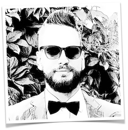

```{r}

```

# Eero Kuusisto-Gussmann

BSc. Pflegewissenschaft\
Gesundheits- und Krankenpfleger\

<p style="color: #E95420">
    <a href="https://twitter.com/eerok" class="icon-link"><span class="fa fa-twitter"></span></a>
    <a href="https://www.xing.com/profile/Eero_KuusistoGussmann/" class="icon-link"><span class="fa fa-xing"></span></a>
    <a href="https://www.linkedin.com/in/eero-kuusisto-gussmann/" class="icon-link"><span class="fa fa-linkedin"></span></a>
    <a href="https://github.com/Eerokg/" class="icon-link"><span class="fa fa-github"></span></a>
</p>

E-Mail: `eero@kuusisto.de`

### <i class="fas fa-info-circle" style="color: #E95420"></i>&nbsp;&nbsp;Die wichtigsten Eckdaten

> * Angehender Pflegewissenschaftler
>   + <font size="2">Student im Master Pflege- und Gesundheitswissenschaften (Halle)</font>
> * Jahrgang 1984
> * Gebürtiger Finne -- seit 2012 in Deutschland (Freiburg)
> * Verheiratet, ein Sohn